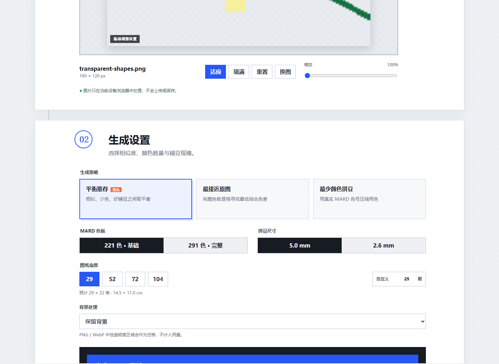
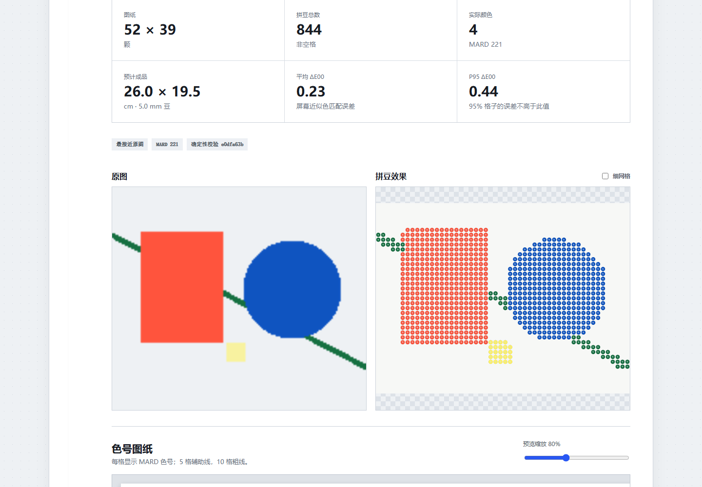
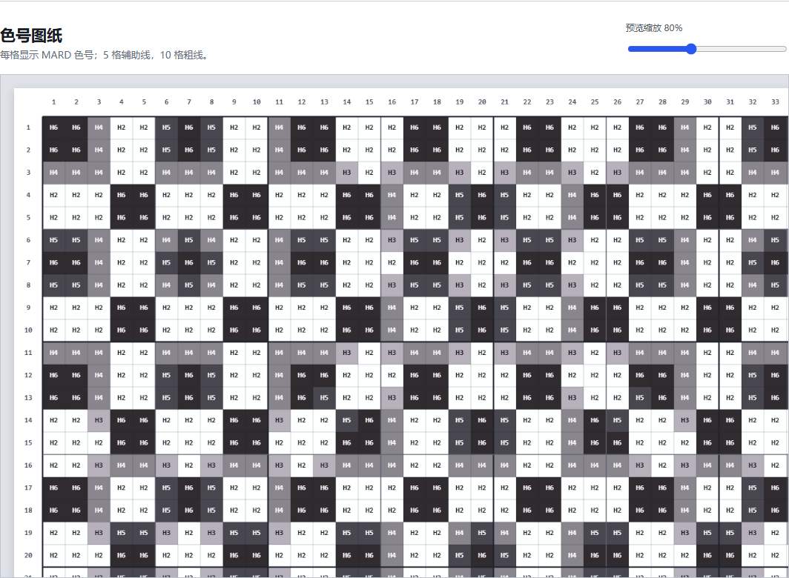
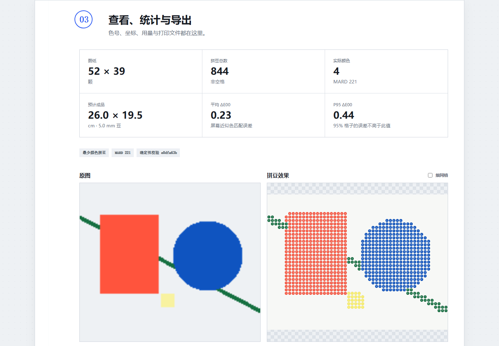
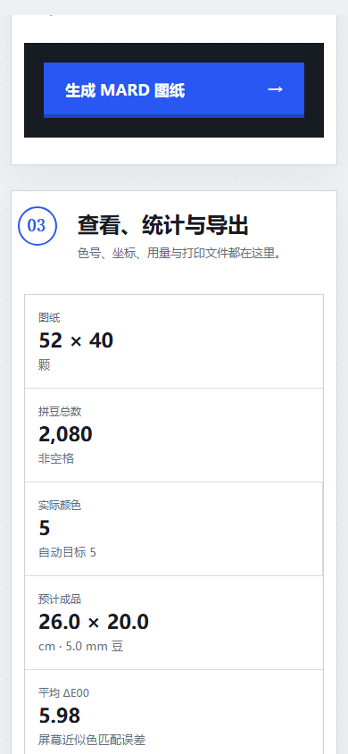

# MARD 拼豆图纸生成器

一个无需后端、账号或 API Key 的中文网页工具：把本地 JPG、PNG 或 WebP 图片转换为带真实 MARD 色号、坐标、用量统计和可打印分页的拼豆图纸。

**在线使用：<https://archmays.github.io/mard-bead-generator/>**

> 图片只在当前设备的浏览器中处理，不上传、不写入服务器或 IndexedDB；刷新页面即可清空。



## 能做什么

- 支持 JPG / JPEG、PNG、WebP，最大 20 MB；超大像素图片会在浏览器内安全缩放用于分析。
- 默认 MARD 221 基础色，另有 291 完整色；图纸每格显示 MARD 色号。
- 29、52、72、104 宽度预设与 10–200 自定义宽度，高度按图片比例计算且单边不超过 200。
- 适应、填满、缩放、拖动；保留透明格，或尝试用边缘采样与洪水填充移除近似纯色背景。
- 输出圆形中空拼豆效果、带绝对坐标与 5/10 格辅助线的铺豆图、MARD 用量和包数估算。
- 下载拼豆效果 PNG、色号图纸 PNG、A4 分页 PDF、UTF-8 BOM CSV。
- 颜色匹配与受限调色板优化在 Web Worker 中执行，可取消，新任务会终止旧任务。





## 三种生成策略

| 模式 | 适合 | 实现重点 |
|---|---|---|
| 平衡推荐 | 大多数照片和插画 | 在综合色差、颜色数量、孤立杂色和实际铺豆之间平衡，默认使用 |
| 最接近原图 | 希望尽量保留颜色与细节 | 在所选完整色板逐格匹配，只做最保守的小区域清理 |
| 最少颜色拼豆 | 希望少买颜色、铺豆更轻松 | 从真实 MARD 色号中优化子集；自动或严格限制为最多 4/6/8/12/16/24 色 |



## 色板版本与免责声明

- 291 色主数据固定到 MIT 许可的 [`maxcleme/beadcolors@29229889`](https://github.com/maxcleme/beadcolors/tree/29229889daab404fb30531d4bb785fd73f7f58e3) 的 `raw/mard.csv`。
- 221 色是 291 色中的 A/B/C/D/E/F/G/H/M 九系列严格子集；291 另含 P/Q/R/T/Y/ZG 70 个扩展色。
- `Jett-Wu/Perler_Beads_Generator` 的 MIT 色板以及两个独立在线色卡用于数量、色号、HEX 和系列关系交叉核对。
- 详细差异、许可证和 clean-room 边界见 [调研与归属](docs/research-and-attribution.md) 与 [第三方声明](THIRD_PARTY_NOTICES.md)。

MARD 色号和屏幕颜色只用于图纸匹配参考。实体颜色可能因光线、屏幕、材料效果和生产批次不同而存在差异。本项目与 MARD 品牌方无隶属或官方合作关系，也不是官方 MARD 工具。

## 使用方式

1. 上传图片，在第一步选择适应/填满，拖动位置并调整缩放。
2. 在第二步选择模式、MARD 221/291、宽度、拼豆尺寸和背景处理。
3. 点击“生成 MARD 图纸”。在第三步检查效果、色号图、误差指标和用量，再下载需要的文件。



## 算法概览

1. **区域采样**：每格按实际覆盖矩形进行 5×5/7×7 自适应多点采样。连续区域在线性 RGB 中稳健平均；局部方差和轮廓较高时优先主导色，避免单像素缩图造成灰边。
2. **感知颜色匹配**：MARD HEX 预计算为 CIELAB；便宜距离只做候选预筛，最终候选由 `culori` 的 CIEDE2000 排序。
3. **真实 MARD 子集优化**：把非空格确定性压缩为最多 128 个带权代表簇；从当前 MARD 色板做加权 greedy facility-location / medoid 选择与 swap refinement。最终色一定可在色板中找到。
4. **连通区域清理**：4 邻域识别 1–3 格小区域；替代色只来自相邻区域，并受 ΔE00 增量、轮廓权重与高饱和细节保护门槛约束。
5. **确定性**：不使用抖动或非固定随机过程；相同输入与设置会得到相同色号哈希。

## 本地开发

需要 Node.js 与 npm。

```bash
npm ci
npm run dev
```

完整本地门禁：

```bash
npm run lint
npm run typecheck
npm run test
npm run build
npm run test:e2e
```

辅助命令：

```bash
npm run fixtures       # 重新生成四张原创合成测试图
npm run palettes:sync  # 从固定 SHA 重新生成 221/291 JSON
```

## 项目边界与已知限制

- 这不是拼豆编辑器：没有画笔、橡皮、油漆桶、逐格换色、图层、撤销重做或导入继续编辑。
- 屏幕 HEX 是参考值，不包含真实材料的珠光、荧光、透明或夜光光学效果。
- “移除边缘纯色背景”只适合纯色或近纯色背景；边缘颜色不一致时会保守保留。
- PDF 将大图切成多页可读网格；200×200 会产生较多页面和较大的文件。
- 当前只支持 MARD，不支持其他品牌，也没有云端保存、账号、社区或画廊。

## 许可证

项目代码使用 [MIT License](LICENSE)。MARD 色板数据的独立版权与 MIT 声明保留在 [THIRD_PARTY_NOTICES.md](THIRD_PARTY_NOTICES.md)。
